# Baysian Classifier

## Key Points

This repository implements a Naive Bayes classifier, a custom logistic regression classifier, and reviews a paper on Bayesian optimization of machine learning algorithms, including a **Django application with a UI** for the Naive Bayes classifier.

**The naive Bayes classifier is also deployed on render**: https://breast-cancer-classifier.onrender.com

**Demo image**

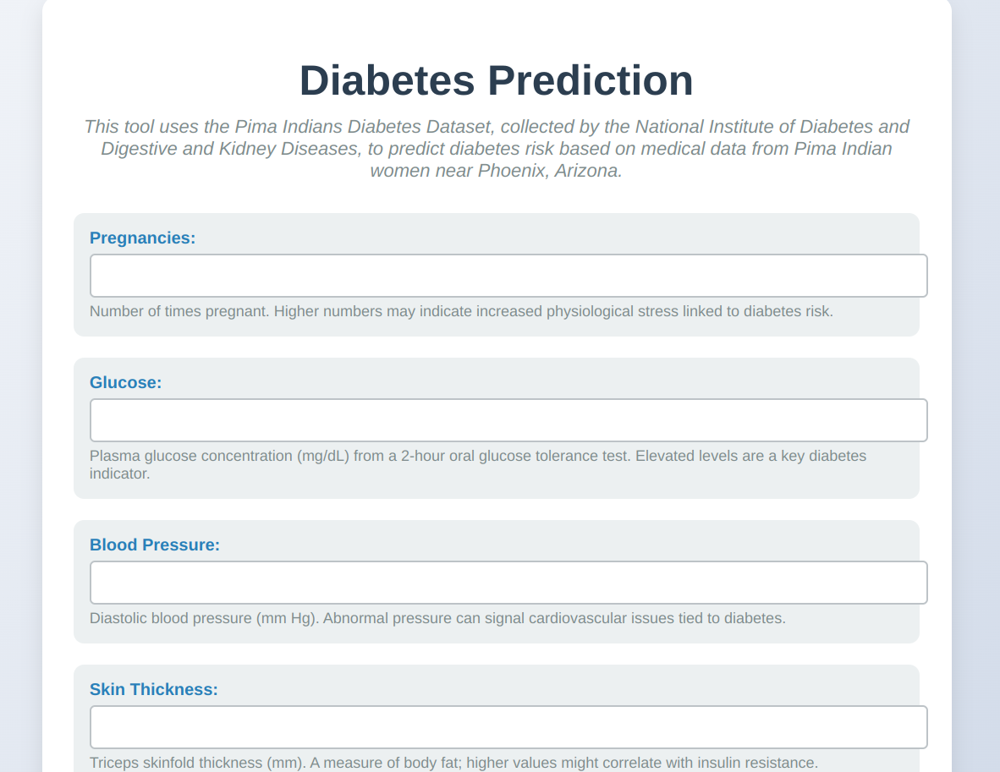


- The Naive Bayes classifier uses medical data, suitable for its probabilistic approach, while the logistic regression classifier is trained on the Iris dataset with only two features for simplicity.

## Introduction
This repository showcases four main implementations 
1. A Naive Bayes classifier for medical data.
2. Django application with a user interface (UI) to interact with the Naive Bayes classifier, making it easy to test predictions.
3. a custom logistic regression classifier trained from scratch.  
4. Review of the paper "Bayesian Optimization of Machine Learning Algorithms(found here ).

A Naive Bayes classifier is a probabilistic machine learning model based on `Bayes theorem`, assuming feature independence, which works well for datasets like medical data where features (e.g., blood pressure, glucose levels) can be treated as conditionally independent given the class (e.g., diabetic or not). This assumption simplifies calculations and is often effective for classification tasks.

The rest of this Document  is organized as follows:

1. Naive Bayes Classifier
    - Dataset Explanation
    - Data Exploration
    - File Structure
2. Logistic Regression Classifier
    - Dataset Used
    - Model Explanation
    - Accuracy and Metrics
3. Paper Review


## 1. Naive Bayes Classifier
The Naive Bayes classifier implementation focuses on a medical dataset,  [`the Pima Indians Diabetes dataset`](https://github.com/npradaschnor/Pima-Indians-Diabetes-Dataset), to predict diabetes risk. This section details the dataset, data exploration, and file structure.

### Dataset Explanation
The Pima Indians Diabetes dataset, collected by the National Institute of Diabetes and Digestive and Kidney Diseases, contains medical data from Pima Indian women near Phoenix, Arizona. It includes **768** samples with **8** features:

### This features are:

**Pregnancies**: Number of times pregnant.

**Glucose**: Plasma glucose concentration.

**BloodPressure**: Diastolic blood pressure.

**SkinThickness**: Triceps skin fold thickness.

**Insulin**: 2-hour serum insulin.

**BMI**: Body mass index.

**DiabetesPedigreeFunction**: Genetic diabetes risk score.

**Age**: Age in years.

**The target variable is binary: 0 for non-diabetic, 1 for diabetic.**

### Data Exploration
Some stats on the dataset are as follows. 0 means non-diabetic, and 1 means diabetic.

The python code used to generate these stats is given at `evaluation_graph.py` in predictor folder

```
Feature: Pregnancies
         count      mean       std  min   25%  50%  75%   max
Outcome                                                      
0        500.0  3.298000  3.017185  0.0  1.00  2.0  5.0  13.0
1        268.0  4.865672  3.741239  0.0  1.75  4.0  8.0  17.0 
```

```
Feature: Glucose

         count        mean        std   min    25%    50%    75%    max
Outcome                                                                
0        500.0  110.682000  24.707201  44.0   93.0  107.5  125.0  197.0
1        268.0  142.130597  29.568839  78.0  119.0  140.0  167.0  199.0 

```

```
Feature: BloodPressure
         count       mean        std   min   25%   50%   75%    max
Outcome                                                            
0        500.0  70.920000  11.929385  24.0  63.5  72.0  78.0  122.0
1        268.0  75.123134  11.951672  30.0  68.0  74.0  82.0  114.0 


```
```
Feature: SkinThickness
         count       mean       std  min   25%   50%   75%   max
Outcome                                                         
0        500.0  26.058000  8.725532  7.0  22.0  23.0  31.0  60.0
1        268.0  29.716418  9.676886  7.0  23.0  27.0  36.0  99.0 
```

```
Feature: Insulin
         count        mean         std   min   25%   50%     75%    max
Outcome                                                                
0        500.0   83.188000   89.565700  15.0  30.5  39.0  105.00  744.0
1        268.0  116.041045  127.689084  14.0  30.5  30.5  167.25  846.0 ```


```
```
Feature: BMI
         count       mean       std   min    25%    50%     75%   max
Outcome                                                              
0        500.0  30.880200  6.503074  18.2  25.75  30.40  35.300  57.3
1        268.0  35.381343  6.596704  22.9  30.90  34.25  38.775  67.1
```

```
Feature: DiabetesPedigreeFunction
         count      mean       std    min      25%    50%      75%    max
Outcome                                                                  
0        500.0  0.429734  0.299085  0.078  0.22975  0.336  0.56175  2.329
1        268.0  0.550500  0.372354  0.088  0.26250  0.449  0.72800  2.420
```

```
Feature: Age

         count       mean        std   min   25%   50%   75%   max
Outcome                                                           
0        500.0  31.190000  11.667655  21.0  23.0  27.0  37.0  81.0
1        268.0  37.067164  10.968254  21.0  28.0  36.0  44.0  70.0 


```

```
Class Distribution:
 Outcome
0    500
1    268
Name: count, dtype: int64


```


```
Skewness of each feature:

Pregnancies: 0.8999119408414357
Glucose: 0.5345406664125946
BloodPressure: 0.14160775043921206
SkinThickness: 1.220667036561888
Insulin: 2.687917738034549
BMI: 0.5998841409874501
DiabetesPedigreeFunction: 1.9161592037386292
Age: 1.127389259531697

```

The skewness values for the features are: Pregnancies (0.90), Glucose (0.53), BloodPressure (0.14), SkinThickness (1.22), Insulin (2.69), BMI (0.60), DiabetesPedigreeFunction (1.92), and Age (1.13). BloodPressure is approximately symmetric, Glucose and BMI are moderately skewed, Pregnancies is moderately skewed, and SkinThickness, Insulin, DiabetesPedigreeFunction, and Age are highly skewed, indicating significant right tails in their distributions.


**some images that describe the dataset will be given below** 

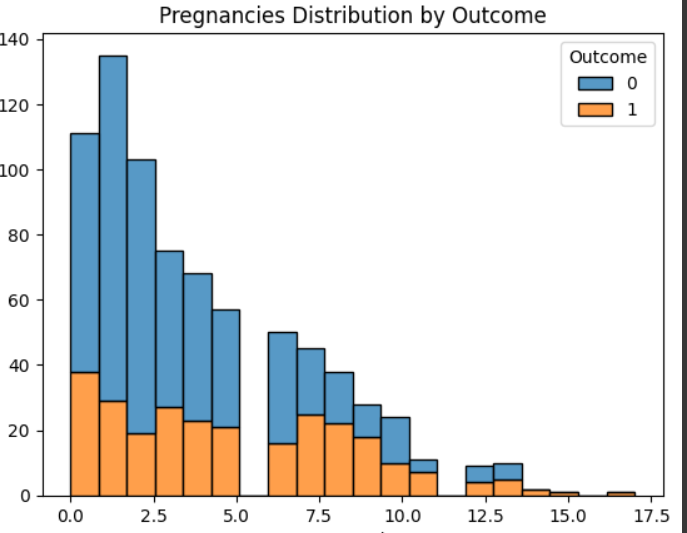

This pregnancy histogram shows the distribution of pregnancies for diabetic and non-diabetic patients. The majority of non-diabetic patients have low pregnancy number , while diabetic patients have a more pregnancies.

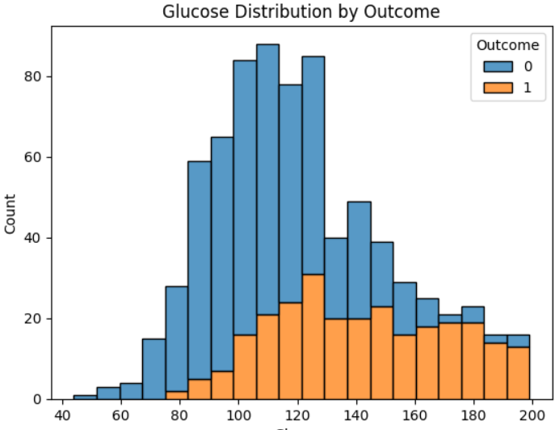

This glucose histogram shows the distribution of glucose levels for diabetic and non-diabetic patients. The majority of non-diabetic patients have low glucose levels, while diabetic patients have higher glucose levels.

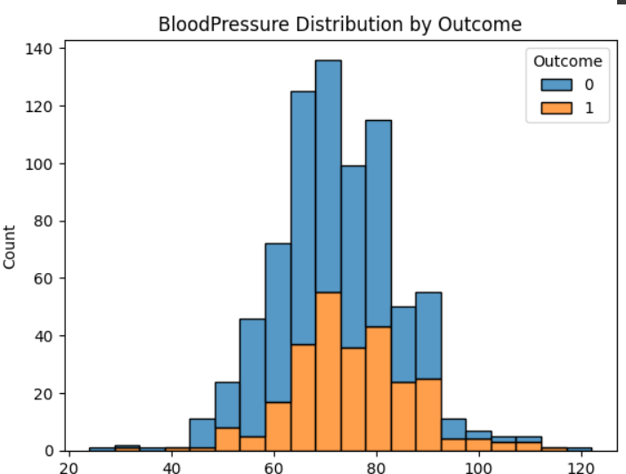
Blood pressure also shows that most diabitic patients have higher blood pressure than non-diabetic patients.

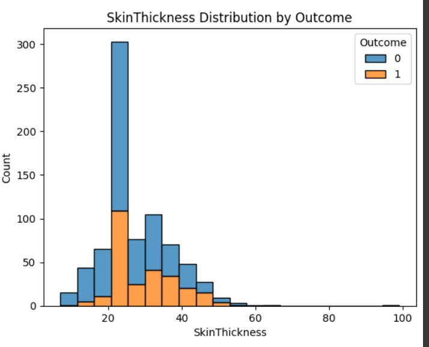
Skin thickness also shows that most diabitic patients have higher skin thickness than non-diabetic patients. But this metrics is not as clear as the other metrics.

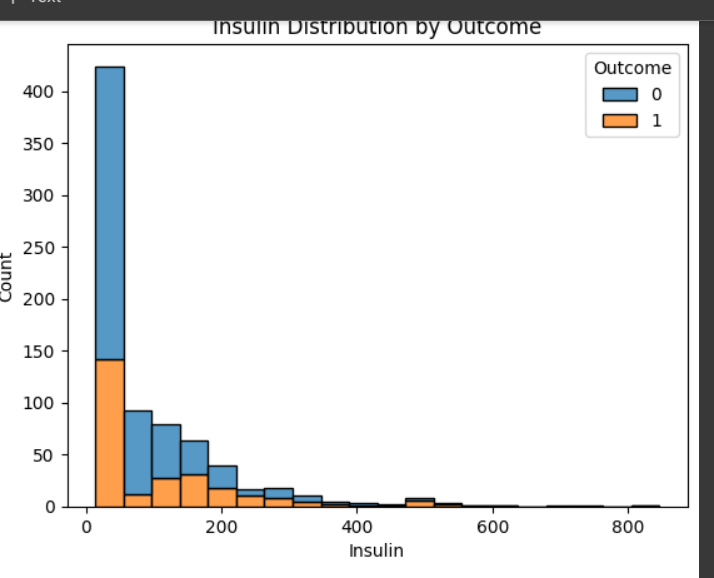


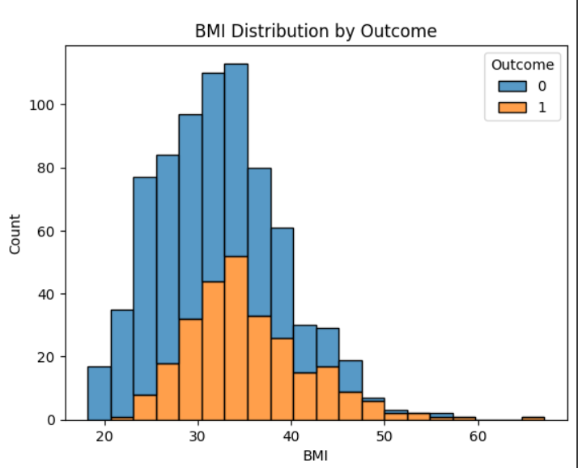

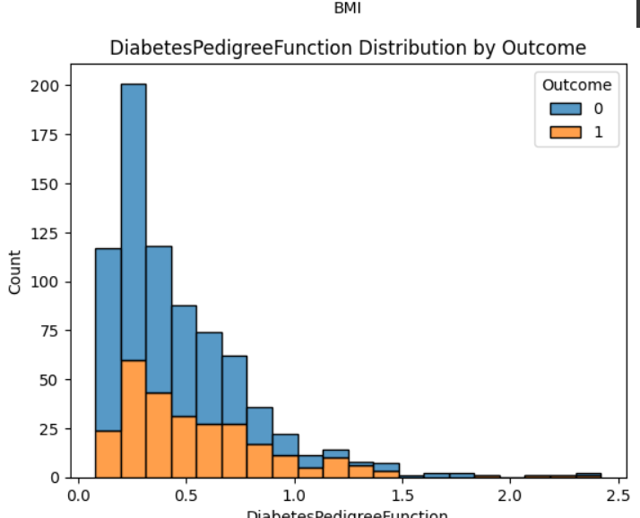

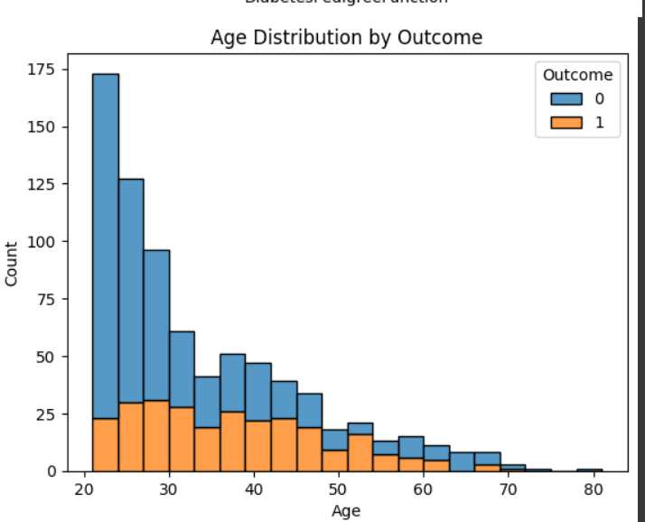


### File Structure
The implementation includes:

**index.html**: The UI for the Django application, featuring a form for inputting medical data (e.g., Pregnancies, Glucose) and displaying predictions. It uses CSS for styling, with input groups for each feature and a submit button.

**train.py**: Trains the Naive Bayes model using scikit-learn’s GaussianNB, preprocessing the Pima dataset, handling missing values, and saving the model with joblib.

**views.py**: Handles HTTP requests, processing form submissions with the trained model, returning predictions, and ensuring CSRF protection for security.


## 2. Logistic Regression Classifier
This section covers the custom logistic regression classifier, trained on the [`Iris dataset`](https://archive.ics.uci.edu/ml/datasets/iris)  with two features for simplicity, and evaluates its performance.

**Dataset Used**
The Iris dataset, available via scikit-learn, contains 150 samples of three iris species, each with 4 features: sepal length, sepal width, petal length, petal width. For this implementation, Two features were selected:

**Two features: Sepal length and sepal width.** These  features were selected for simplicity and visualization.

**Two classes:** Iris-setosa (0) and Iris-versicolor (1), filtering out Iris-virginica, resulting in 100 samples (50 per class). The dataset was split into 70% training (70 samples) and 30% testing (30 samples).

### Model Explanation
The logistic regression model is implemented from scratch using NumPy, with:

- Sigmoid function for probability mapping.
- Gradient descent for training, updating weights and bias over 1000 iterations with a learning rate of 0.1.
- Prediction by thresholding at 0.5 for binary classification.
 Scatter plot of sepal length vs. sepal width, colored by class, showing separation.

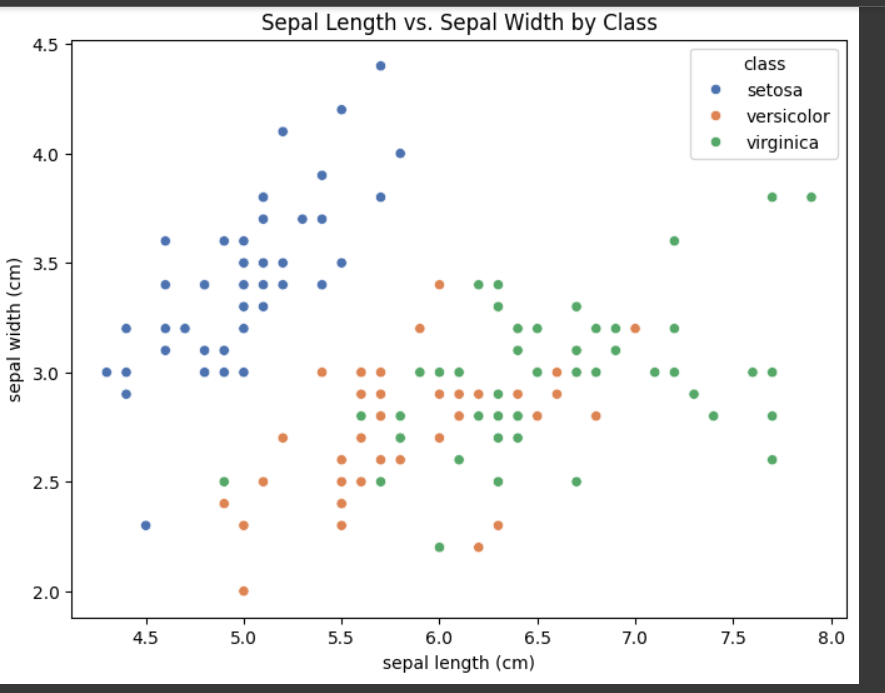

```

Accuracy and Metrics
The model achieved:

Training Accuracy: ~98.57%
Testing Accuracy: 100% 

```

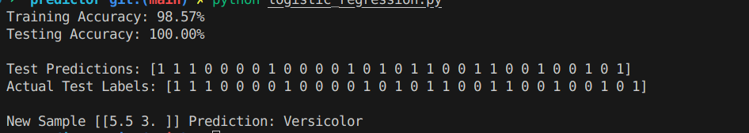


## 3.Paper Review

The paper "Practical Bayesian Optimization of machine learning algorithms" was published in 2012. This paper address the challenge hyperparameter optimization in machine learning. In this summery of the paper, we will try to see the challenges this paper addresses, the methodology and techniques used and finally some experimental results

Hyperparameter tuning or optimization is a well known issue in machine learning.It is tweeking the hyperparameters of the model so that best result is achieved.currently there are two common approachs, The first one is to bruteforce some known values in order to find the best hyperparameters in some defined values that are set by the model developer. This method is known as grid search. The second method is called random search, where the hyperparameters are randomly selected from a defined range. Both these appraoches are not efficient and are computationally expensive.There for the paper proposes a new method called Bayesian optimization.


Baysian optimization empolyes a probabilistic model to model the objective function and then uses the model to select the next hyperparameters to evaluate. The model is updated as new hyperparameters are evaluated. The optimization algorithm uses a helper model called Guassian Process to predict the next hyperparameters to evaluate. This function is based on observed data points.The GP provides a probabilistic prediction, including mean and uncertainty, which an acquisition function uses to decide the next hyperparameter configuration to evaluate. The Expected Improvement (EI) acquisition function is highlighted, balancing exploration of uncertain regions and exploitation of promising ones. 

The algorithm follows these steps:

**Initialization** - Evaluate a small, random set of hyperparameter configurations.
**Modeling** -  Fit the GP to the observed data, predicting performance across the hyperparameter space.
**Optimization** -  Use the acquisition function to select the next configuration, maximizing expected improvement.
**Iteration** - Update the GP with the new evaluation and repeat until a budget (e.g., time or iterations) is exhausted.

The paper validates the framework through many  experiments

**Deep Neural Networks**: On a convolutional neural network for image classification, it outperformed random search and manual tuning, achieving lower error rates in fewer iterations (e.g., ~10-20 vs. hundreds).

**Latent Dirichlet Allocation (LDA):** Optimized hyperparameters for topic modeling, reducing perplexity significantly faster than baselines.

**Benchmarks:** Compared against grid search, random search, and expert tuning, showing consistent improvements in efficiency and performance.
